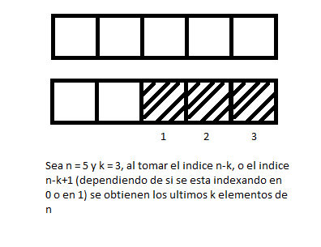
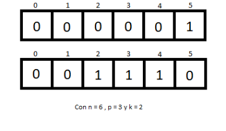
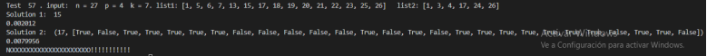

# Arian Pazo Valido C-311

## Orientación
Tito el tramposo

Tito está pasando un curso de Diseño y Análisis de Algoritmos. Este año, por primera vez en la historia, los profesores han decidido evaluar el curso mediante un examen final y Tito se ha dado cuenta de que, a grandes rasgos, está frito. A pesar de ser un poco barco, es de hecho un muchacho inteligente y rápidamente se da cuenta que su única forma de aprobar era hacer trampa. El día de la prueba, Tito se sentó en el asiento que estaba entre Hansel y Elena para fijarse, con la esperanza de que, uniendo las preguntas respondidas por cada uno, se pudiera formar un examen correcto.

El examen tiene $n$ preguntas, ordenadas en la hoja. Elena y Hansel pueden no ser capaces de responder cada uno el examen entero, pero todas las preguntas que responden, están correctas. Se conoce cuáles preguntas respondió cada uno y se reciben como dos listas ordenadas de enteros entre 1 y n. Tito tiene p oportunidades para mirar hacia la izquierda (hoja de Hansel) o hacia la derecha (Hoja de Elena) y su agilidad mental le alcanza para ver las respuestas de k preguntas consecutivas (en cualquier posición) cada vez que echa una mirada a un examen.
Ayude a Tito a saber la cantidad máxima de preguntas que puede responder con su (tramposa) estrategia.
## Transformando el problema
Dadas dos listas de enteros ordenados y no repetidos de 1 a n , un entero p y un entero k, se desea devolver la mayor cantidad de enteros distintos que se pueden ver, si se puede revisar las listas iniciales p veces partiendo de cualquier índice i , y solo ver hasta los enteros i+k cada vez. 

# **Método Backtrack 1**

La idea del método backtrack es hacer una recursión en p, donde cada llamado pasa por todos los índices i de 0 a n-1 probando mirar en cada lista. Durante el proceso se va contando y actualizando el máximo tal que al final se obtenga el valor de la solución máxima.

**Demostración de que el método implementado mira todas las opciones y guarda la máxima.**
- $p_i$ se refiere a la mirada que analizamos, $p>= i >= 1$ .

- índice de $p_i$  es el índice a partir del cual un $p_i$  específico va a ver k elementos.

El código crea un árbol en el que cada nivel representa todas las elecciones de índice posibles de un  específico (por lo que el árbol tiene altura p). 

Luego para cada uno de los nodos, sus hijos son todas las elecciones de índice posible del p siguiente ($p_{i-1}$), en ambas listas, hasta que $i = 1$. En ese momento el llamado recursivo para, y cuenta cuantos enteros  se ven con las decisiones de índice de todos los p anteriores y los guarda en caso de mejorar el máximo. 

Esta cuenta solo la realizamos en las hojas por ahorrarnos contar innecesariamente en cada nodo, y por que tenemos la seguridad que no va a haber un máximo en el árbol que no sea al menos representado en una de las hojas. Como el acto de mirar en  solo puede añadir enteros a la lista o mantenerla igual, al llegar al máximo de una de las ramas del árbol, dicho máximo se mantendrá hasta llegar a las hojas.

**Algunas podas al algoritmo**

Debido a que al escoger  un índice a partir del cual leer k enteros en n, se obtienen dichos k elementos no tiene sentido escoger los últimos n-k índices de n pues en el índice n-k+1 se obtendrán los últimos k elementos.

Debido a que no es posible que la cantidad de enteros encontrados sea mayor que la cantidad maxima de enteros (n) el algoritmo al encontrar n enteros deja de buscar mejores máximos y devuelve el resultado.
De la misma forma no es posible obtener una cantidad de enteros mayor que la cantidad de elementos distintos máximos que se podrían ver (p*k) así que en el caso donde se alcancen p*k enteros el algoritmo deja de buscar mejores máximos y devuelve el resultado.

**Complejidad Temporal**

Utilizando el método del árbol recursivo podemos calcular que cada nodo tiene costo k, excepto para las hojas las cuales por la regla de la suma tienen costo . Cada nodo del árbol tiene hijos, pero con el propósito de ver el caso peor y simplificar el problema diremos que tiene 2*n hijos. El árbol tiene altura p por lo que  para el nivel i, con   el nivel tiene  nodos si sumamos todos los nodos por regla de la suma la cantidad de nodos es  lo cual nos lleva a una complejidad temporal final de :

$O((2n)^p * max(n,k)) = O(n^p * max(n,k))$   

Para los casos que importan ya que si  entonces para p=1 se puede ver una de las listas completa, y para p=2 se pueden ver las dos listas enteras. Por lo tanto:
 o lo que es equivalente:
 
$O(n^p * max(n,k)) = O(n^p * n)$ o lo que es equivalente $O(n^{p+1})$

## **Otro Método Backtrack 2**

Este otro método puede ser visto como una poda del método anterior, pero como surgió de forma independiente decidí separarlo en dos métodos distintos. Tiene como intención reducir la cantidad de nodos del árbol potencialmente a la mitad por cada nivel . 
La idea con la que trabaja es que dado un  y un índice desde donde mirar, se puede decidir de antemano en cual de las dos listas es mejor mirar, y entonces llamar recursivo solo en esa. 

Existen tres casos posibles, los cuales ejemplificare para que sean más claros:

- Existe la posibilidad de que para un índice específico ninguna de las dos listas pertenezcan a ninguno de los máximos, en ese caso la recursividad continuará como lo hacía normalmente y descartará esa elección (i=0 en la imagen).

- En el caso en el que dado un índice solo una de las listas pertenezca a el óptimo que halla el algoritmo, esta lista va a ser naturalmente la que aporte la mayor cantidad de enteros totales a el óptimo (i=2 en la imagen).

- En el caso en el que dado un índice específico ambas listas pertenezcan al óptimo, el algoritmo naturalmente escogerá la que aporte la mayor cantidad de enteros al óptimo inicialmente (o el primero en caso de que ambos aporten la misma cantidad (índice 4 del ejemplo)) pero naturalmente regresara al mismo índice en la otra lista cuando no queden mejores opciones.

## Complejidad Temporal

Como dijimos este método es realmente una poda del anterior, y la diferencia está en que cada nodo tiene n hijos, en lugar de 2*n hijos, por lo que la complejidad temporal final sigue siendo:

$O(n^p * n)$ o lo que es equivalente $O(n^{p+1})$

# **Iterative Solution ?**

La tercera idea fue crear un árbol en el que los hijos de un nodo en lugar de ser todos los índices posibles sean todos los índices para los cuales el siguiente p consigue la máxima cantidad de enteros nuevos (un nodo puede tener un solo hijo en el caso en el que exista un índice que vea más enteros nuevos que el resto de índices, o varios hijos en el caso de que hayan varios índices distintos (distinto índice y lista de origen) que vean más enteros nuevos que el resto de índices , y la misma cantidad entre ellos).
 
Tristemente luego de la implementación llegué a algunos contra-ejemplos que prueban que la idea no funciona :

(puede que sea necesario usar el zoom para ver el ejemplo)

En este ejemplo era posible llegar a un máximo de 17 enteros siguiendo los siguientes pasos:

- Tomando a partir del indice 0 en la lista 2, se obtienen 1 , 3 ,4 para un total de 3

- Tomando a partir del indice 4 en la lista 1, se obtienen 5 , 6 ,7 para un total de 6

- Tomando a partir del indice 12 en la lista 1, se obtienen 13, 15 ,17 , 18,19 para un total de 11

- Tomando a partir del indice 19, en la lista 1, se obtienen 20, 21, 22, 23, 25 ,26 para un total de 17

Pero el método planteado solo encuentra 15, debido a la estrategia greedy que sigue.

# **Ternary Tree**

Esta idea se centra en iterar por todos los n, creando un árbol en el que por cada nodo se toma la decisión de añadir el elemento tomándolo de la primera lista(si está en la lista), tomándolo de la segunda lista(si está en la lista) y no añadir el elemento. Al tomarlo de una de las dos listas se añaden los k consecutivos con él.

En cada una de las iteraciones de n, se itera por una lista que contiene todos los nodos activos ( aquellos nodos para los cuales $p >= 1$ ).

En todo momento los nodos revisan si la cantidad de elementos que han observado son mayores que el máximo global y en dicho caso se actualiza. 

Los nodos se mantienen ejecutando los  3 distintos pasos descritos anteriormente mientras que p (la cantidad de veces que pueden tomar índices) sea mayor que 0 pues al llegar a 0 no se pueden seguir viendo índices y el máximo en caso de ser necesario ya fue actualizado. 

Por lo tanto aunque el tiempo en el peor caso será analizado luego, debemos destacar que el peor caso solo se da cuando todos los valores de n, son True para ambas listas, p = n y k = 1. Pues en cualquier caso que no sea estos la cantidad de nodos activos a la misma vez disminuyen. Si en cualquiera de las listas un valor es False, ese nodo no sera iniciado eliminando así una rama del árbol. 

Cuando p < n se dará el caso en el que una cantidad de nodos (que depende de la diferencia entre n y p) llegarán a p = 0 y dejarán de formar parte de los ciclos. Siempre que k > 1 al tomar un índice cualquiera se tomarán también los k-1 índices siguientes, lo cual llevará a que si en alguno de estos índices habían enteros en el momento de la recursión de n en el que les toque ser analizados no se tomen pues no aportan nada al ejercicio, (en caso de que no estuviesen en la lista, no se analizaría tampoco).

**Complejidad Temporal**

El algoritmo consiste de un for, con i de 1 a n, donde en cada iteración se recorre un array que contiene a todos los nodos activos, los nodos activos comienzan siendo un nodo vacío y se analiza si mirar a partir del indice i en las listas de enteros 1, 2 (en cualquiera de esos casos el nodo se crea con p-1) o no hacer nada. Con lo que se crean hasta 3 nodos que pasan a ser lo nuevos nodos activos, un nodo es activo mientras que su p sea mayor que 0, para crear cada nodo es necesario, contar cuantos enteros ha visto (se cuentan los k desde i hasta i+k, o sea, O(k)), así como actualizar la lista de índices de p que ha tomado y en caso de que él mismo sea el máximo hasta el momento actualizar también el máximo. Todas estas operaciones se hacen en tiempo constante por lo que no afectan el tiempo del algoritmo, por todo lo antes mencionado el algoritmo es :

$O(n*m*k)$

Con m siendo la longitud máxima de la lista de nodos activos, en el caso peor que expliqué anteriormente $m=3^n $ pero para la mayoría de los casos m es considerablemnte menor .

## Nota: 
Este método devuelve una tupla compuesta por:
- El primer elemento es la cantidad de enteros máximos observados 
- El segundo elemento es una lista de con True en el indice de un elemento que fue observado y False en los que no
- El tercer elemento es una lista constituida por tuplas de la forma (X,Y) donde X representa el indice desde el que se tomo un entero y Y la lista de la que fue tomado

# **Intento de programación dinámica**

En un intento de mejorar el algoritmo pensé en la subestructura optima que podría tener para hacer un algoritmo dinámico. Algunos ejemplos de subestructuras optimas que no funcionaron son:

- El óptimo para  no necesariamente pertenece al optimo de p con $p'$. Por ejemplo sea p = 3 , $p'$ = 2 , k = 3 , a = [1,2,3,4,6,7,8,9] y b = [], una solución optima para  es tomar a partir del indice 1 en a, y a partir del indice 6 en a, se obtiene el máximo que se puede ver los elementos [2,3,4,7,8,9] (6) , pero a partir de  este ejemplo de  no se puede obtener una solución optima para p .

- Después pensé contar la cantidad de elementos en cada intervalo de tamaño k, y escoger en cada p el que maximice la cantidad de elementos vistos , pero este aproach al ser probado no funcionó ya que escoger un k modifica las elecciones para los k posteriores por lo que no son disjuntos.

- Otra posibilidad sería una dinámica con mas dimensiones  teniendo en cuenta ademas de el p, el índice en el que fue escogido tal que dp[p,i] contiene la máxima suma de todo lo que se hizo en el  dp[p-1,i]  y lo que se puede ver en este p para el índice i. Resulto resolver el problema correctamente para casi todos los casos, pero tristemente hay ejemplos en los que falla.